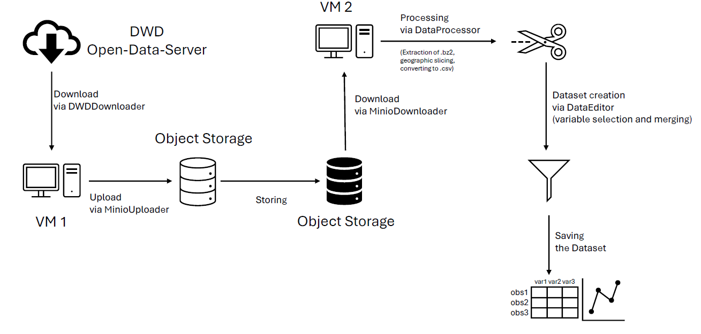

# dwdown

`dwdown` is a Python package designed to download weather forecast data from the Deutscher Wetterdienst (DWD), process it, and upload it to a MinIO object storage server. It supports downloading forecast files, uploading them to cloud storage, and processing them for analysis. Furthermore it keeps you informed about the status of downloads, uploads, and any errors.

## Features

- **DWDDownloader**: Fetch weather forecast data from the DWD open data server.
- **MinioDownloader**: Download files from a S3 compatible / [MinIO object storage server](https://github.com/minio/minio).
- **MinioUploader**: Upload downloaded data to a S3 compatible / MinIO object storage server with parallel uploads and data integrity checks.
- **DataProcessor**: Extract, convert and filter data for further analysis.
- **DataEditor**: Filter and merge CSV data.
- **Notifier**: Receive status messages of downloads, uploads, and any errors from a [Gotify server](https://github.com/gotify).
- **Logging**: Automatically log download and upload activities, and handle errors gracefully.
- **Parallel Uploading**: Upload large datasets in parallel for faster performance.
- **Automatic Bucket Creation**: Create MinIO buckets if they do not exist.

## Installation

You can install `dwdown` via pip:

```bash
git clone https://github.com/trholy/dwdown.git 

pip install .
```

## Documentation

Read the documentation on [GitLab Pages](https://to82lod.gitpages.uni-jena.de/dwdown/).

## Usage

### Example Workflow



### DWDDownloader: Download Data from DWD

The `DWDDownloader` class allows you to download weather forecast files from the DWD open data server.

```python
from dwdown.download import DWDDownloader

# Initialize DWDDownloader
dwd_downloader = DWDDownloader(
    url="https://opendata.dwd.de/weather/nwp/icon-d2/grib/09/aswdifu_s/",
    restart_failed_downloads=False,  # Dont retry failed downloads
    log_downloads=True,  # Log download status
    delay=0.1,  # 0.1 seconds delay between downloads
    workers=4,  # Use 4 concurrent workers
    download_path="download_files",  # Path for downloaded files
    log_files_path="log_files"  # Path for log files
)

# Fetch download links
dwd_downloader.get_links(
    exclude_pattern=["icosahedral"],
    min_timestep=0,
    max_timestep=10
)

# Download files
dwd_downloader.download_files(
    check_for_existence=True,
    max_retries=3
)

# Print status after download
print("Successfully downloaded files:", dwd_downloader.downloaded_files)
print("Failed downloads:", dwd_downloader.failed_files)
print("Finally failed downloads:", dwd_downloader.finally_failed_files)
```

### MinioUploader: Upload Data to MinIO

The `MinioUploader` class helps upload files to a [MinIO object storage server](https://github.com/minio/minio), ensuring data integrity with MD5 hash verification.

```python
from dwdown.upload import MinioUploader

# Initialize MinioUploader
uploader = MinioUploader(
    endpoint="your-minio-sever.com",
    access_key="your-access-key",
    secret_key="your-secret-key",
    files_path="download_files",  # Path for files to upload
    bucket_name="weather-forecasts",  # Name of the minio bucket 
    secure=False,  # If ‘true’ API requests will be secure (HTTPS), and insecure (HTTP) otherwise
    log_uploads=True,  # Log upload status
    log_files_path="log_files",  # Path for log files
    workers=4  # Use 4 concurrent workers
)

# Upload files to MinIO
uploader.upload_directory()

# Print status after upload
print("Successfully uploaded files:", uploader.uploaded_files)
print("Upload might be corrupted:", uploader.corrupted_files)
```

### MinioDownloader: Download Data from MinIO

The `MinioDownloader` class helps you download files from a [MinIO object storage server](https://github.com/minio/minio).

```python
from dwdown.download import MinioDownloader

# Initialize MinioDownloader
minio_downloader = MinioDownloader(
    endpoint="your-minio-sever.com",
    access_key="your-access-key",
    secret_key="your-secret-key",
    files_path="download_files",  # Path for files to download
    secure=False,  # If ‘true’ API requests will be secure (HTTPS), and insecure (HTTP) otherwise
    log_downloads=True,  # Log upload status
    log_files_path="log_files",  # Path for log files
    workers=4  # Use 4 concurrent workers
)

# Download files from MinIO
minio_downloader.download_bucket(
    bucket_name="weather-forecasts",  # Name of the minio bucket 
    folder_prefix='aswdifu_s'
)
    
# Print status after upload
print("Successfully downloaded files:", minio_downloader.downloaded_files)
print("Download might be corrupted:", minio_downloader.corrupted_files)
```

### DataProcessor: Process and Convert Data

The `DataProcessor` class provides tools for extracting, converting, filtering and processing data.

```python
from dwdown.processing import DataProcessor

# Initialize the DataProcessor
editor = DataProcessor(
    search_path="download_files",  # Path for files to process
    extraction_path="extracted_files",  # Path for extracted files
    converted_files_path="csv_files",  # Path for CSV files
)

# Retrieve the filenames that have been downloaded
file_names = editor.get_filenames()

# Convert downloaded files into CSV format
editor.get_csv(
    file_names=file_names,
    apply_geo_filtering=True,
    start_lat=50.840,
    end_lat=51.000,
    start_lon=11.470,
    end_lon=11.690
)
```

### Data Processing with DataEditor

The `DataEditor` class provides tools for merging and filtering CSV data.

```python
from dwdown.processing import DataEditor

# Variables to build merged dataframe from
variables = [
    'aswdifd_s',
    'relhum',
    'smi',
]

# External mapping dictionary
mapping_dictionary = {
    'aswdifd_s': 'ASWDIFD_S',
    'relhum': 'r',
    'smi': 'SMI',
}

# Pattern selection for known variables
additional_patterns = {
    "relhum": [200, 975, 1000],
    "smi": [0, 9, 27],
}

# Initialize DataEditor
data_editor = DataEditor(
    files_path='csv_files/09/',
    required_columns={
        'latitude', 'longitude', 'valid_time'
    },
    join_method='inner',
    mapping_dictionary=mapping_dictionary,
    additional_pattern_selection=additional_patterns,

)

df = data_editor.merge_dfs(
    time_step=0,
    variables=variables
)
print("Processed DataFrame:", df)
```

### Notifier: Send Status Updates

The `Notifier` class keeps you informed about the status of downloads, uploads, and any errors via a [Gotify server](https://github.com/gotify).

```python
from minio import Minio
from dwdown.notify import Notifier

# Initialize Notifier
notifier = Notifier(
    server_url="your-gotify-sever.com",
    token="your-access-token",
    priority=5,
    secure=False  # Set to True if your MinIO server is HTTPS
)

# Initialize minio client
minio_client = Minio(
    endpoint="your-minio-sever.com",
    access_key="your-access-key",
    secret_key="your-secret-key",
    secure=False  # Set to True if your MinIO server is HTTPS
)

# List all buckets
buckets = minio_client.list_buckets()

status_dict = {}

for bucket in buckets:
    bucket_name = bucket.name
    print(f"Processing bucket: {bucket_name}")

    # List all objects in the bucket
    objects = minio_client.list_objects(bucket_name, recursive=True)

    # Get number of objects in the bucket
    status_dict[bucket_name] = [len([obj.object_name for obj in objects])]

# Send notification
notifier.send_notification(
    message=status_dict,
    script_name="download-VM"
)
```

## Directory Structure

The package structure is as follows:

```
dwdown/
├── src/
│   ├── dwdown/
│   │   ├── __init__.py
│   │   ├── downloader/
│   │   │   ├── download.py
│   │   │   ├── __init__.py
│   │   ├── notify/
│   │   │   ├── notifier.py
│   │   │   ├── __init__.py
│   │   ├── uploader/
│   │   │   ├── upload.py
│   │   │   ├── __init__.py
│   │   ├── processor/
│   │   │   ├── processing.py
│   │   │   ├── __init__.py
│   │   ├── tools/
│   │   │   ├── tools.py
│   │   │   ├── __init__.py
├── example_usage/
│   ├── dwd_processing.py
│   ├── dwd_scraper.py
│   ├── minio_downloader.py
│   ├── minio_uploader.py
│   ├── notifier.py
├── pyproject.toml
├── README.md
├── LICENSE
├── .gitignore
```

## Dependencies

- `lxml`: Required for parsing XML files (for DWD data).
- `minio`: For uploading files to a MinIO server.
- `pandas`: For data processing and handling CSV files.
- `requests`: For making HTTP requests to the DWD API.
- `xarray`: For handling multi-dimensional arrays (used for handling weather data).

### Optional Development Dependencies
- `pytest`: For running tests.
- `ruff`: For linting Python code.

## License

This project is licensed under the **Creative Commons Attribution 4.0 International License (CC BY 4.0)**. You are free to share, adapt, and build upon the material, even for commercial purposes, as long as you provide appropriate credit. For more details, visit [CC BY 4.0](https://creativecommons.org/licenses/by/4.0/).

## Attribution

When using or adapting this software, please give appropriate credit to the original author:  
Thomas R. Holy ([thomas.robert.holy@gmail.com](mailto:thomas.robert.holy@gmail.com)).


## Authors & Maintainers

- Thomas R. Holy, Ernst-Abbe-Hochschule Jena, (thomas.robert.holy@gmail.com)

## Contributing

If you’d like to contribute to the development of `dwdown`, feel free to fork the repository, create a branch for your feature or fix, and submit a pull request.

---
